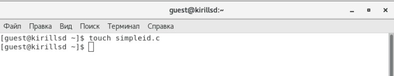
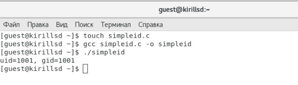
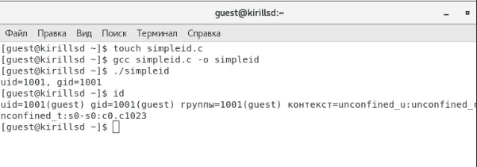
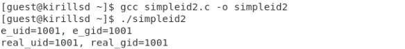
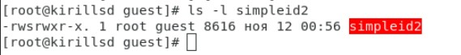
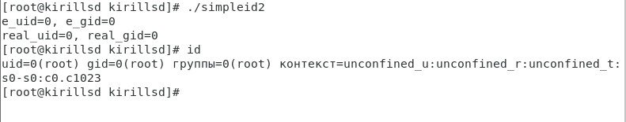

---
## Front matter
lang: ru-RU
title: Лабораторная работа №5
author: |
	Сидоракин
institute: |
	 RUDN University, Moscow, Russian Federation
date: Ноябрь, 2021 Москва

## Formatting
toc: false
slide_level: 2
theme: metropolis
sansfont: NotoMono-Regular
header-includes: 
 - \metroset{progressbar=frametitle,sectionpage=progressbar,numbering=fraction}
 - '\makeatletter'
 - '\beamer@ignorenonframefalse'
 - '\makeatother'
aspectratio: 43
section-titles: true
---
## Цель лабораторной работы

Получение практических навыков работы в консоли с расширенными атрибутами файлов

## Создаем программу simpleid.c:
{ #fig:001 width=50% }

## Скомплилируем программу gcc simpleid.c -o simpleid
{ #fig:002 width=50% }

## Выполняем программу simpleid: ./simpleid
{ #fig:003 width=50% }

## Выполняем системную программу id: 
{ #fig:003 width=50% }

## Усложняем программу, добавив вывод действительных идентификаторов:
{ #fig:004 width=50% }

## Компилируем и запускаем simpleid2.c:
{ #fig:007 width=50% }

## От имени суперпользователя выполняем команды:
{ #fig:007 width=50% }

## Используем sudo
{ #fig:007 width=50% }

## Выполняем проверку правильности установки новых атрибутов файла simpleid2
{ #fig:007 width=50% }

## Запускаем simpleid2 и id 
{ #fig:007 width=50% }

## Создаем программу readfile.c
{ #fig:007 width=50% }

## Откомпилируем её
{ #fig:007 width=50% }

## Вывод
В результате выполнения лабораторной работы мы получили навыки изучения механизмов изменения идентификаторов, применения SetUID- и Sticky-битов. 
Получили практические навыки работы в консоли с дополнительными атрибутами. 
Рассмотрели работы механизма смены идентификатора процессов пользователей, а также влияние бита Sticky на запись и удаление файлов.